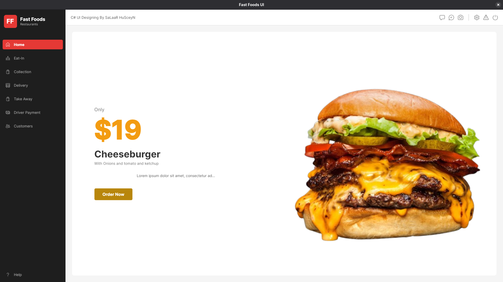

# Fast Foods UI - Avalonia App

## Description
A simple desktop app for a fast foods restaurant interface, built with Avalonia UI. Features sidebar navigation and dynamic views for Home (promo) and Eat-In (food cards).

## Built With
- Avalonia UI (.NET 9.0) for cross-platform desktop UI.
- C# for code-behind logic.
- FluentIcons.Avalonia for sidebar icons.
- Assets folder for images (cheeseburger.png, cake.png, pidzza.png).

## How to Use
1. **Prerequisites**: Install .NET 9.0 SDK.

2. **Setup**: 
   - Clone or navigate to the project: `cd /home/mellow/code/C#/designflat_melvin`.
   - Restore packages: `dotnet restore`.

3. **Build**: Run `dotnet build` (ignores minor warnings).

4. **Run**: Execute `dotnet run` to launch the app.
   - Click "Home" for promo view.
   - Click "Eat-In" for menu cards (scroll if needed).
   - Resize window to test responsiveness.

For development, use VS Code with C# extension and `dotnet watch run` for hot reload.
